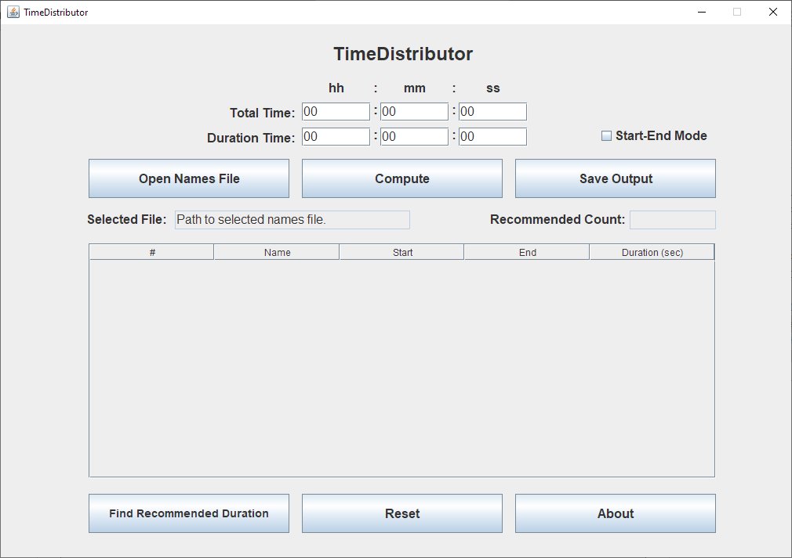
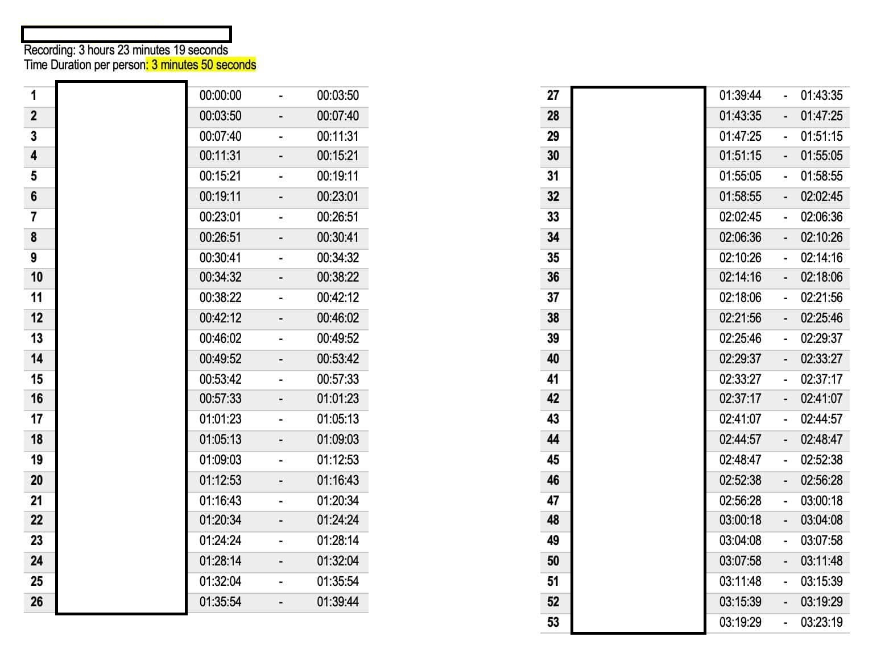
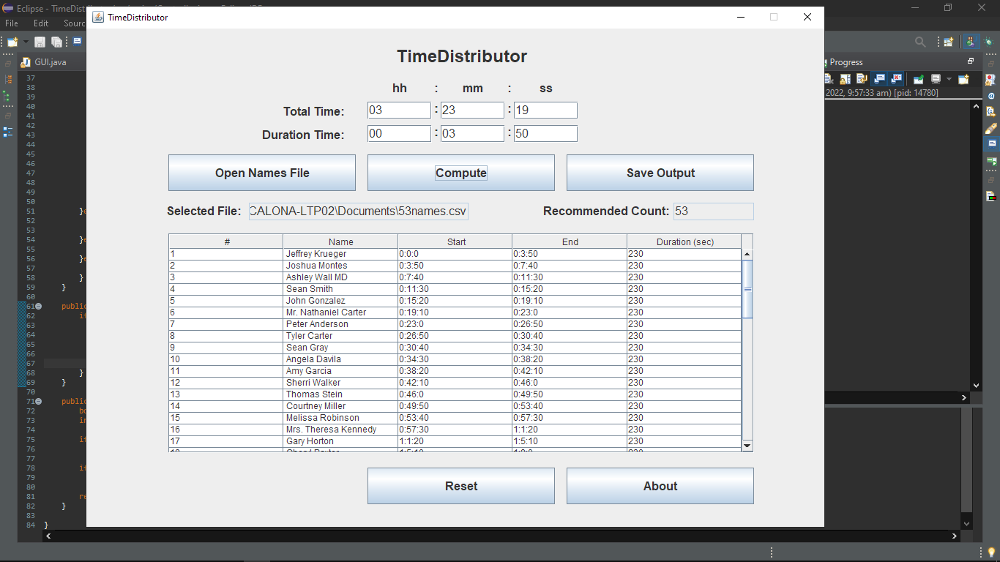

# TimeDistributor

## [Web App](https://jm55dlsu.github.io/TimeDistributor/)

## Description
This project was a commission for purposes of human resource management. Specifically, the task was to simply distribute a certain task (transcribing in this case) across a number of people by dividing the number of people on a given individual allotted time over a total allotted time.

## Example:
### Input:
The image shown in 1 shows the following inputs:
1. Total Time (hh:mm:ss): 03:23:19
2. Duration (hh:mm:ss): 00:03:50
### Output:
1. Sample Expected Output

2. Actual Output

## Project Client:
The project was commissioned by a student from [DLSU-HSI](https://www.dlshsi.edu.ph/) for the student organization's use.
